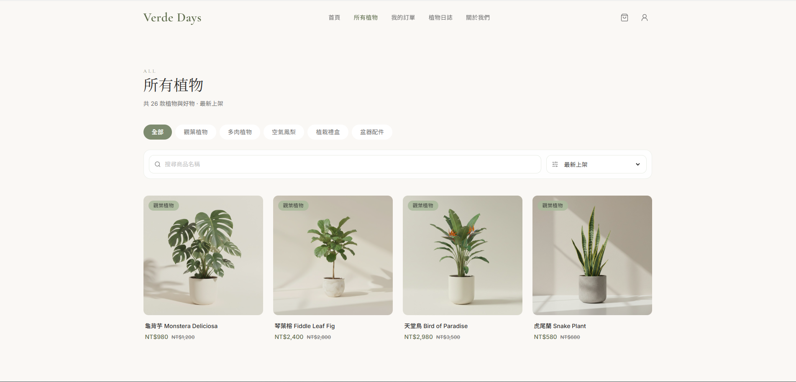
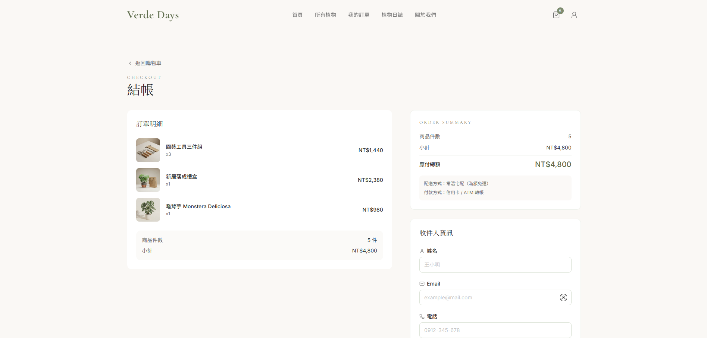
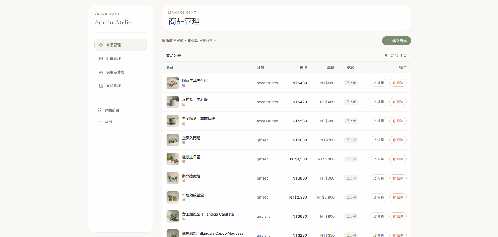

# Verde Days

A production-oriented React commerce frontend that emphasizes engineering structure, maintainability, and delivery quality.

## Live Demo

- https://ryansparkc.github.io/verde-days-frontend-legacy/

## Project Snapshot

- Built with React 19 + React Router 7 + Redux Toolkit in a layered architecture.
- Covers end-to-end storefront flows: catalog, product detail, cart, coupon, checkout, orders.
- Includes admin management flows for products, orders, coupons, and articles.
- Uses service adapters to normalize API shapes and keep UI concerns separate from transport concerns.
- Applies practical performance improvements (parallel article page fetching, request deduplication + cache, stable memoized instances).


## Key Engineering Decisions

- Route-level code splitting with `lazy` + `Suspense` to reduce initial bundle cost.
- Domain-based Redux slices (`cart`, `order`, `catalog`, `message`) to keep state boundaries explicit.
- Service layer as the API adapter boundary for normalization, filtering, pagination, and cache logic.
- Test-first updates for behavior-sensitive optimizations to prevent hidden regressions.

## Key Features

### Storefront

- Product browsing with category filtering, keyword search, and sorting.
- Product detail with image gallery and related product suggestions.
- Cart item updates, coupon application, and order checkout submission.
- Orders list and order detail views with payment action handling.
- Article listing, tag filtering, and article detail recommendations.

### Admin

- Product CRUD with image upload support.
- Order status management and deletion flows.
- Coupon CRUD with date/percentage validation.
- Article CRUD and publish/unpublish controls.

## Project Structure

```text
src/
  pages/          # Route-level screens (storefront + admin)
  components/     # Reusable UI by feature/layout/common
  slice/          # Redux Toolkit slices and async thunks
  services/       # API/service adapters and admin clients
  store/          # Redux store setup
  utils/          # Shared utility helpers
docs/plans/       # Design and implementation planning docs
```

## Data Flow

1. A route page triggers user interaction or initial load.
2. The page dispatches a thunk or calls a service adapter.
3. Services normalize and fetch data from API endpoints.
4. Slices update global state, and UI re-renders from selectors.

## Testing and Quality

- Run all tests:
  - `pnpm test`
- Run static checks:
  - `pnpm lint`
- Current suite includes:
  - Service-level tests (`articleService`, admin services)
  - Page behavior tests (`Articles`, `ArticleDetail`, admin pages)
  - Slice-level tests (`catalogReducer`)
  - Component-level regression test (`Testimonials`)

## Performance Improvements

- Parallelized multi-page article fetching to avoid sequential waterfalls.
- Added in-flight request deduplication and TTL caching for article list access.
- Cached `Intl.NumberFormat` formatter instances in utility layer.
- Memoized carousel autoplay plugin instance to prevent unnecessary recreation on rerender.

## Deployment

- Target: GitHub Pages
- Repository: https://github.com/RyanSparkc/verde-days-frontend-legacy
- Base path: auto-generated as `/<repo-name>/` in production (fallback: `/verde-days-frontend-legacy/`)
- Optional override: set `VITE_PAGES_REPO` before build (for renamed repos)
- Deploy command:
  - `pnpm deploy`

## Completed Milestones

- Storefront commerce flow completed (catalog -> cart -> checkout -> orders).
- Admin backoffice modules completed (products, orders, coupons, articles).
- Article API integration and related recommendation behaviors completed.
- Performance remediation pass completed for data fetching and render stability.

## Screenshots

### Home


### Product List



### Checkout



### Admin



## Quick Start

### Prerequisites

- Node.js 20+
- pnpm 9+

### Run Locally

```bash
pnpm install
pnpm dev
```

### Build and Preview

```bash
pnpm build
pnpm preview
```

## Environment Variables

Create `.env` based on `.env.sample`:

```env
VITE_API_BASE=...
VITE_API_PATH=...
```

## Scope Note

This repository focuses on frontend architecture and delivery quality. Admin features are for management/testing workflows and are intentionally documented without credential disclosure.
