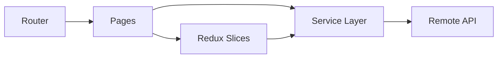

# README Engineering Showcase Design

## Goal

Create an English-first, reviewer-oriented README that demonstrates engineering capability within 30 seconds: clear architecture, reliable quality gates, and production-minded frontend decisions.

## Audience

- Primary: technical reviewers / interview evaluators.
- Secondary: collaborators who need a quick project mental model.

## Positioning

This project should be presented as a frontend engineering portfolio artifact, not only a UI showcase and not a generic template app.

## Information Architecture (recommended order)

1. `Title + one-line positioning`
2. `Live Demo` (top of page)
3. `Project Snapshot` (3-5 bullets)
4. `Architecture at a Glance` (simple Mermaid)
5. `Key Engineering Decisions`
6. `Key Features` (`Storefront` / `Admin`)
7. `Project Structure`
8. `Data Flow`
9. `Testing & Quality`
10. `Performance Improvements`
11. `Deployment`
12. `Completed Milestones`
13. `Screenshots`
14. `Quick Start`
15. `Environment Variables`
16. `Scope Note`

## Content Design

### Project Snapshot

Use short, verifiable bullets. Emphasize:
- React 19 + Router + Redux Toolkit layered architecture.
- Storefront flows (catalog, cart, checkout, orders).
- Admin management flows (products, orders, coupons, articles).
- Recent performance hardening (parallel fetching, dedupe cache, memoization).

### Architecture at a Glance

Keep diagram simple:

### Key Engineering Decisions

Include rationale-style bullets:
- Route-level code splitting via lazy + Suspense.
- Service adapters for API shape normalization.
- Slice separation by domain (`cart`, `order`, `catalog`, `message`).
- Performance fixes with measurable impact paths.

### Testing & Quality

Show commands and trust signals:
- `pnpm test`
- `pnpm lint`
- Mention page tests + service tests + admin flow tests.

### Completed Milestones

No roadmap section. Use done-only items (date or commit-themed milestones) to show delivery track record.

## Writing Style Rules

- English-first README content.
- Short paragraphs; avoid marketing tone.
- Every claim should be traceable to code structure or commands.
- Prefer concrete nouns and actions over adjectives.

## Security and Disclosure Rules

- Do not expose admin credentials.
- Describe admin capability without sensitive setup leakage.

## Media Strategy

Include 3-5 screenshots:
- Home
- Products (with filtering/search)
- Checkout
- Admin dashboard/list screen

Prefer repository-hosted assets (for stable links), e.g. `docs/screenshots/*.png`.

## Acceptance Criteria

A reviewer should be able to:

1. Understand project scope and architecture in under one minute.
2. Run the project locally using commands from README only.
3. See explicit evidence of testing and engineering decisions.
4. Validate deployment target and environment setup without extra docs.
